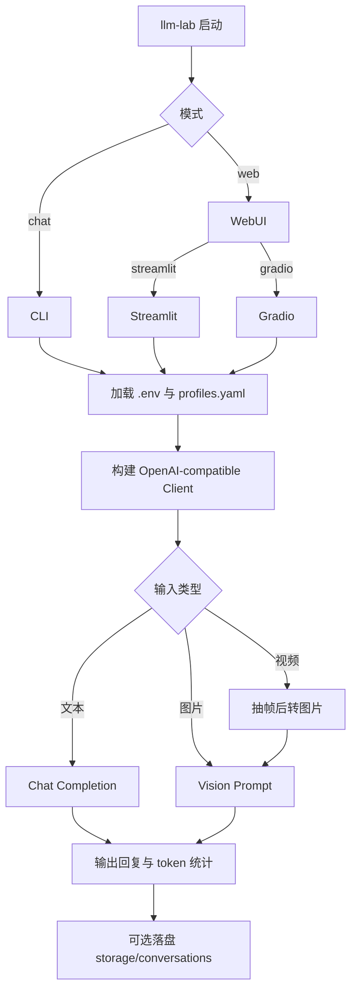

# LLM Lab

一个用于测试 OpenAI-compatible 模型的单入口工具，支持 CLI + WebUI 多模态对话。

[English Version](README_EN.md)

## 1. 产品亮点

- 单入口命令：`llm-lab`
- 多种交互方式：
  - CLI（Rich 终端界面）
  - WebUI（Streamlit / Gradio）
- 多 profile 管理：可快速切换 provider 和 model
- 多模态输入：图片直传，视频自动抽帧
- 会话追踪：支持保存、加载、回放聊天记录

## 2. 运行流程



## 3. 项目结构

```text
.
├── app/                  # 入口层（main / cli / web）
├── service/              # 核心服务（chat / capability / session）
├── utils/                # 配置、client、媒体处理、日志
├── config/               # profiles 配置
├── storage/              # 会话与日志输出
├── tests/                # 测试
├── setup.sh              # 一键安装与初始化
├── pyproject.toml        # 依赖源头
└── requirements.txt      # 导出依赖清单
```

## 4. 快速开始

### 4.1 一键初始化（推荐）

```bash
bash setup.sh
```

### 4.2 手动初始化

```bash
pip install -r requirements.txt
pip install -e .
cp .env.example .env
cp config/profiles.example.yaml config/profiles.yaml
```

> [!NOTE]
> `config/profiles.yaml` 中 `api_key_env` 指向的环境变量，必须在 `.env` 中存在并具有有效值。
>
> 例如：`api_key_env: OPENAI_API_KEY` 时，`.env` 需要有 `OPENAI_API_KEY = ...`。
>
> [!TIP]
> 首次验证链路，推荐先使用 CLI：
> `llm-lab chat --stream`
>
> [!TIP]
> 如果你使用 Conda 环境执行命令，可以直接使用：
> `conda run -n llm_test llm-lab chat`

## 5. 配置说明

### 5.1 `.env` 常用字段

- `LLM_LAB_PROFILE`：默认 profile
- `LLM_LAB_MODEL`：默认模型
- `LLM_LAB_PROFILES_PATH`：配置文件路径

### 5.2 `config/profiles.yaml` 示例

```yaml
default_profile: dashscope_qwen

profiles:
  dashscope_qwen:
    base_url: https://dashscope.aliyuncs.com/compatible-mode/v1
    api_key_env: LLM_API_KEY
    default_model: qwen-max
    timeout_seconds: 60
    capabilities:
      supports_text: true
```

### 5.3 配置优先级

1. 命令行参数
2. `.env`
3. `config/profiles.yaml` 默认值

## 6. 启动示例

### 6.1 CLI

```bash
llm-lab chat
llm-lab chat --stream
llm-lab chat --profile dashscope_qwen --model qwen-max
llm-lab chat --save-session
```

### 6.2 WebUI

```bash
llm-lab web --ui streamlit --host 127.0.0.1 --port 8501
llm-lab web --ui gradio --host 127.0.0.1 --port 7860
```

## 7. CLI 命令速查

| 命令 | 功能 |
|---|---|
| `/help` | 查看命令帮助 |
| `/status` | 查看运行状态 |
| `/profiles` | 查看可用 profile |
| `/use <profile_id>` | 切换 profile |
| `/model <model_name>` | 切换模型 |
| `/stream on\|off` | 设置流式输出 |
| `/temp <float>` | 设置 temperature |
| `/top_p <float>` | 设置 top-p |
| `/image <path1,path2,...>` | 下一轮附加图片 |
| `/video <path>` | 下一轮附加视频 |
| `/clear` | 清空会话 |
| `/save [file_name]` | 保存会话 |
| `/load <file_path>` | 加载会话 |
| `/exit` | 退出 |
| `/quit` | 退出（同 `/exit`） |

## 8. 界面预览占位

将截图放到 `assets/readme/` 后，README 会自动展示：

- `cli-home.png`
- `cli-help.png`
- `cli-chat.png`
- `web-streamlit.png`
- `web-gradio.png`

| 场景 | 预览 |
|---|---|
| CLI 启动 |  |
| CLI 帮助 |  |
| CLI 对话 |  |
| Streamlit 页面 |  |
| Gradio 页面 |  |

## 9. 依赖维护

本项目采用双文件依赖管理：

- `pyproject.toml`：主依赖源
- `requirements.txt`：同步导出结果

同步命令：

```bash
python scripts/sync_requirements.py
```

## 10. 常见问题

| 问题 | 解决方案 |
|---|---|
| `llm-lab: command not found` | 运行 `pip install -e .` |
| `Missing API key` | 检查 `.env` 是否包含 `profiles.yaml` 所引用的 `api_key_env` |
| 视频处理失败 | 确认 `opencv-python-headless` 已安装 |

## 11. License

本项目使用 `MIT License`，详见 `LICENSE`。
