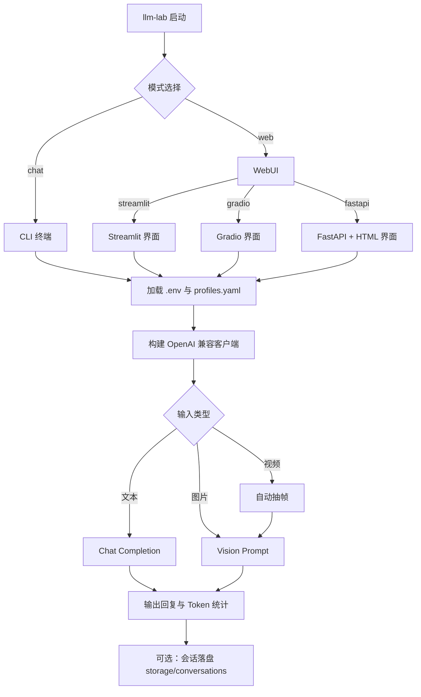

# LLM Lab

<div align="center">
  
  <h3>🚀 一个用于测试 OpenAI-compatible 模型的单入口工具</h3>
  <p>支持 CLI + WebUI 多模态对话 | 多 Profile 管理 | 会话追踪</p>

  <div style="display: flex; gap: 8px; justify-content: center; flex-wrap: wrap;">
    
    
    
    
    
    
    
  </div>

  <p style="margin-top: 16px;">
    <a href="README_EN.md">English Version</a> | 中文版本
  </p>
</div>

---

## 🎯 项目亮点

### 核心优势
- **单入口命令**: 只需 `llm-lab` 一个命令，统一所有交互
- **多种交互方式**:
  - **CLI**: 基于 Rich 的美观终端界面，支持流式输出
  - **WebUI**: 提供 Streamlit、Gradio、FastAPI(HTML) 三种现代化界面
- **智能配置管理**: 多 Profile 管理，快速切换不同模型和服务商
- **多模态支持**:
  - 🖼️ 图片直传
  - 🎥 视频自动抽帧
- **会话追踪**: 完整的聊天记录保存、加载、回放功能

---

## 🔄 运行流程



---

## 📁 项目结构

```text
.
├── app/                  # 入口层（main / cli / web）
├── service/              # 核心服务（chat / capability / session）
├── utils/                # 工具模块（配置、客户端、媒体处理、日志）
├── config/               # 配置文件目录
├── storage/              # 会话与日志输出
├── tests/                # 测试套件
├── setup.sh              # 一键安装与初始化脚本
├── pyproject.toml        # 依赖管理源文件
└── requirements.txt      # 导出的依赖清单
```

---

## 🚀 快速开始

### 方法一：一键初始化（推荐）

```bash
bash setup.sh
```

### 方法二：手动初始化

```bash
# 安装依赖
pip install -r requirements.txt
pip install -e .

# 初始化配置文件
cp .env.example .env
cp config/profiles.example.yaml config/profiles.yaml
```

> [!NOTE]
> `config/profiles.yaml` 中 `api_key_env` 指向的环境变量，必须在 `.env` 中存在并具有有效值。
>
> 例如：`api_key_env: OPENAI_API_KEY` 时，`.env` 需要有 `OPENAI_API_KEY = ...`。

> [!TIP]
> 首次验证链路，推荐先使用 CLI 流式模式：
> ```bash
> llm-lab chat --stream
> ```

> [!TIP]
> 如果你使用 Conda 环境，可以直接运行：
> ```bash
> conda run -n llm_test llm-lab chat
> ```

---

## ⚙️ 配置说明

### 5.1 `.env` 常用字段

```env
# 核心配置
LLM_LAB_PROFILE = dashscope_qwen      # 默认 Profile
LLM_LAB_MODEL = qwen-max             # 默认模型
LLM_LAB_PROFILES_PATH = config/profiles.yaml  # 配置文件路径

# API 密钥（根据需要启用）
OPENAI_API_KEY = sk-xxx              # OpenAI 密钥
DASHSCOPE_API_KEY = xxx             # 阿里通义千问密钥
KIMI_API_KEY = xxx                   # Kimi 密钥
VOLCES_API_KEY = xxx                 # 火山引擎密钥
SILICON_API_KEY = xxx                # 硅基流动密钥
DEEPSEEK_API_KEY = xxx               # DeepSeek 密钥
GLM_API_KEY = xxx                    # 智谱 AI 密钥
```

### 5.2 `config/profiles.yaml` 示例

```yaml
default_profile: dashscope_qwen

profiles:
  openai_default:
    base_url: https://api.openai.com/v1
    api_key_env: OPENAI_API_KEY
    default_model: gpt-4o-mini
    models:
      - gpt-4o-mini
      - gpt-4o

  dashscope_qwen:
    base_url: https://dashscope.aliyuncs.com/compatible-mode/v1
    api_key_env: DASHSCOPE_API_KEY
    default_model: qwen-max
    models:
      - qwen-max
      - qwen-plus
    enable_deep_thinking: false

  kimi_moonshot:
    base_url: https://api.moonshot.cn/v1
    api_key_env: KIMI_API_KEY
    default_model: moonshot-v1-8k
    models:
      - moonshot-v1-8k
      - moonshot-v1-32k

  volces_ark:
    base_url: https://ark.cn-beijing.volces.com/api/v3
    api_key_env: VOLCES_API_KEY
    default_model: Doubao-Seed-2.0-pro-260215
    models:
      - Doubao-Seed-2.0-pro-260215
      - Kimi-K2-Thinking-251104
      - DeepSeek-V3.2-251201
    model_aliases:
      Doubao-Seed-2.0-pro-260215: ep-your-endpoint-id
      Kimi-K2-Thinking-251104: ep-your-endpoint-id-2
      DeepSeek-V3.2-251201: ep-your-endpoint-id-3

  siliconflow_default:
    base_url: https://api.siliconflow.cn/v1
    api_key_env: SILICON_API_KEY
    default_model: Qwen/Qwen2.5-7B-Instruct
    models:
      - Qwen/Qwen2.5-7B-Instruct
      - deepseek-ai/DeepSeek-V3

  deepseek_default:
    base_url: https://api.deepseek.com/v1
    api_key_env: DEEPSEEK_API_KEY
    default_model: deepseek-chat
    models:
      - deepseek-chat
      - deepseek-reasoner

  glm_default:
    base_url: https://open.bigmodel.cn/api/paas/v4
    api_key_env: GLM_API_KEY
    default_model: glm-4-flash
    models:
      - glm-4-flash
      - glm-4-plus
```

> [!TIP]
> `models` 用于给每个 Provider 提供可切换模型列表（Web/CLI 切换时会读取这个列表）。
> 如果你有更多可用模型，直接继续追加到对应 Provider 的 `models`。
>
> `model_aliases` 用于“显示名 -> 实际请求模型 ID”映射。
> 例如界面显示 `Doubao-Seed-2.0-pro-260215`，请求时自动使用 `ep-...` endpoint_id。
>
> `enable_deep_thinking` 用于控制是否启用深度思考模式。若配置为 `true` 但当前模型不支持，
> 程序会给出 warning，并自动回退到普通模式继续执行。

### 5.3 配置优先级

1. **命令行参数**（最高）
2. **.env 文件**（中间）
3. **profiles.yaml 默认值**（最低）

> [!NOTE]
> 当你显式传入 `--profile` 但未传 `--model` 时，会优先使用该 Profile 在
> `profiles.yaml` 中的 `default_model`，避免被 `.env` 里的全局 `LLM_LAB_MODEL` 覆盖。

---

## 🎮 启动示例

### CLI 模式

```bash
# 基础聊天
llm-lab chat

# 流式输出（推荐）
llm-lab chat --stream

# 特定 Profile 和模型
llm-lab chat --profile dashscope_qwen --model qwen-max
llm-lab chat --profile kimi_moonshot --model moonshot-v1-8k
llm-lab chat --profile openai_default --model gpt-4o-mini
llm-lab chat --profile volces_ark --model ep-your-model-id
llm-lab chat --profile siliconflow_default --model Qwen/Qwen2.5-7B-Instruct
llm-lab chat --profile deepseek_default --model deepseek-chat
llm-lab chat --profile glm_default --model glm-4-flash

# 保存会话
llm-lab chat --save-session
```

### WebUI 模式

```bash
# 默认启动 Streamlit（默认 8501 端口）
llm-lab web --host 127.0.0.1 --port 8501

# 显式指定 Streamlit
llm-lab web --ui streamlit --host 127.0.0.1 --port 8501

# Gradio 界面（默认 7860 端口）
llm-lab web --ui gradio --host 127.0.0.1 --port 7860

# FastAPI + HTML 界面（默认 8000 端口）
llm-lab web --ui fastapi --host 127.0.0.1 --port 8000
```

---

## 💬 CLI 命令速查

| 命令 | 功能 | 示例 |
|---|---|---|
| `/help` | 查看所有命令帮助 | `/help` |
| `/status` | 查看运行状态 | `/status` |
| `/profiles` | 列出可用 Profile | `/profiles` |
| `/use <profile>` | 切换 Profile | `/use dashscope_qwen` |
| `/model <model>` | 切换模型 | `/model qwen-max` |
| `/stream <on/off>` | 设置流式输出 | `/stream on` |
| `/think <on/off>` | 设置 thinking 模式 | `/think on` |
| `/temp <float>` | 设置温度参数 | `/temp 0.7` |
| `/top_p <float>` | 设置 top-p 参数 | `/top_p 0.9` |
| `/image <path>` | 附加图片 | `/image /path/to/image.jpg` |
| `/video <path>` | 附加视频 | `/video /path/to/video.mp4` |
| `/clear` | 清空会话 | `/clear` |
| `/save [name]` | 保存会话 | `/save my_chat` |
| `/load <path>` | 加载会话 | `/load storage/conversations/my_chat.json` |
| `/exit` / `/quit` | 退出程序 | `/exit` |

---

## 📦 依赖维护

本项目采用双文件依赖管理：

- **主依赖源**: `pyproject.toml`（使用 Poetry 管理）
- **导出结果**: `requirements.txt`（用于 pip 安装）

同步命令：

```bash
python scripts/sync_requirements.py
```

---

## ❓ 常见问题

### 故障排查

| 问题 | 解决方案 |
|---|---|
| `llm-lab: command not found` | 运行 `pip install -e .` 重新安装 |
| `Missing API key` | 检查 `.env` 文件是否包含 `profiles.yaml` 中引用的环境变量 |
| 视频处理失败 | 确认已安装 `opencv-python-headless` 包 |
| 依赖冲突 | 尝试使用 Conda 环境或创建虚拟环境 |

---

## 📄 许可证

本项目使用 **MIT License**，详见 `LICENSE` 文件。

---

## 🤝 贡献指南

欢迎提交 Issue 和 Pull Request！

---

<div align="center">
  <p style="color: #666; font-size: 14px;">
    Built with ❤️ by Brench
  </p>
</div>
