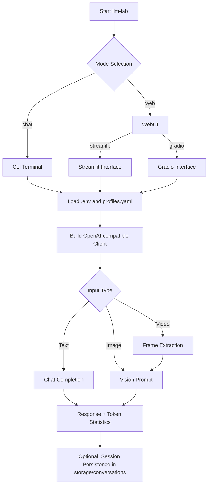

# LLM Lab

<div align="center">
  
  <h3>🚀 A single-entry testing tool for OpenAI-compatible models</h3>
  <p>Supports CLI + WebUI multimodal chat | Multi-profile routing | Session persistence</p>

  <div style="display: flex; gap: 8px; justify-content: center; flex-wrap: wrap;">
    
    
    
    
    
    
  </div>

  <p style="margin-top: 16px;">
    English Version | <a href="README.md">中文版本</a>
  </p>
</div>

---

## 🎯 Key Features

### Core Advantages
- **Single command entry**: Just `llm-lab` to unify all interactions
- **Multiple interaction modes**:
  - **CLI**: Beautiful Rich-powered terminal UI with streaming support
  - **WebUI**: Modern interfaces with Streamlit and Gradio options
- **Intelligent configuration**: Multi-profile management for quick model/service switching
- **Multimodal support**:
  - 🖼️ Direct image upload
  - 🎥 Video frame extraction
- **Session persistence**: Full chat history save/load/replay capabilities

---

## 🔄 Runtime Flow



---

## 📁 Project Structure

```text
.
├── app/                  # Entrypoints (main / cli / web)
├── service/              # Core services (chat / capability / session)
├── utils/                # Utilities (config, client, media processing, logger)
├── config/               # Profile configurations
├── storage/              # Session and logs output
├── tests/                # Test suite
├── setup.sh              # One-shot setup script
├── pyproject.toml        # Dependency management source
└── requirements.txt      # Exported dependency list
```

---

## 🚀 Quick Start

### Method 1: One-shot Setup (Recommended)

```bash
bash setup.sh
```

### Method 2: Manual Setup

```bash
# Install dependencies
pip install -r requirements.txt
pip install -e .

# Initialize config files
cp .env.example .env
cp config/profiles.example.yaml config/profiles.yaml
```

> [!NOTE]
> The environment variable referenced by `api_key_env` in `config/profiles.yaml`
> must exist in `.env` and contain a valid API key.
>
> Example: If `api_key_env: OPENAI_API_KEY`, `.env` must have `OPENAI_API_KEY = ...`.

> [!TIP]
> For first-run validation, use CLI streaming mode:
> ```bash
> llm-lab chat --stream
> ```

> [!TIP]
> If using Conda environment:
> ```bash
> conda run -n llm_test llm-lab chat
> ```

---

## ⚙️ Configuration

### 5.1 `.env` Key Fields

```env
# Core configuration
LLM_LAB_PROFILE = dashscope_qwen      # Default profile
LLM_LAB_MODEL = qwen-max             # Default model
LLM_LAB_PROFILES_PATH = config/profiles.yaml  # Config file path

# API Keys (enable as needed)
OPENAI_API_KEY = sk-xxx              # OpenAI API key
DASHSCOPE_API_KEY = xxx             # DashScope (Alibaba) API key
KIMI_API_KEY = xxx                   # Kimi API key
VOLCES_API_KEY = xxx                 # Volces API key
SILICON_API_KEY = xxx                # SiliconFlow API key
DEEPSEEK_API_KEY = xxx               # DeepSeek API key
GLM_API_KEY = xxx                    # Zhipu AI API key
```

### 5.2 `config/profiles.yaml` Example

```yaml
default_profile: dashscope_qwen

profiles:
  openai_default:
    base_url: https://api.openai.com/v1
    api_key_env: OPENAI_API_KEY
    default_model: gpt-4o-mini
    models:
      - gpt-4o-mini
      - gpt-4o

  dashscope_qwen:
    base_url: https://dashscope.aliyuncs.com/compatible-mode/v1
    api_key_env: DASHSCOPE_API_KEY
    default_model: qwen-max
    models:
      - qwen-max
      - qwen-plus
    enable_deep_thinking: false

  kimi_moonshot:
    base_url: https://api.moonshot.cn/v1
    api_key_env: KIMI_API_KEY
    default_model: moonshot-v1-8k
    models:
      - moonshot-v1-8k
      - moonshot-v1-32k

  volces_ark:
    base_url: https://ark.cn-beijing.volces.com/api/v3
    api_key_env: VOLCES_API_KEY
    default_model: Doubao-Seed-2.0-pro-260215
    models:
      - Doubao-Seed-2.0-pro-260215
      - Kimi-K2-Thinking-251104
      - DeepSeek-V3.2-251201
    model_aliases:
      Doubao-Seed-2.0-pro-260215: ep-your-endpoint-id
      Kimi-K2-Thinking-251104: ep-your-endpoint-id-2
      DeepSeek-V3.2-251201: ep-your-endpoint-id-3

  siliconflow_default:
    base_url: https://api.siliconflow.cn/v1
    api_key_env: SILICON_API_KEY
    default_model: Qwen/Qwen2.5-7B-Instruct
    models:
      - Qwen/Qwen2.5-7B-Instruct
      - deepseek-ai/DeepSeek-V3

  deepseek_default:
    base_url: https://api.deepseek.com/v1
    api_key_env: DEEPSEEK_API_KEY
    default_model: deepseek-chat
    models:
      - deepseek-chat
      - deepseek-reasoner

  glm_default:
    base_url: https://open.bigmodel.cn/api/paas/v4
    api_key_env: GLM_API_KEY
    default_model: glm-4-flash
    models:
      - glm-4-flash
      - glm-4-plus
```

> [!TIP]
> Use `models` to define a switchable model list per provider (used by Web/CLI model switching).
> If your account has more models, append them under that provider's `models` list.
>
> Use `model_aliases` for "display name -> actual request model id" mapping.
> Example: show `Doubao-Seed-2.0-pro-260215` in UI while sending `ep-...` endpoint_id in API calls.
>
> Use `enable_deep_thinking` to control deep-thinking mode. If set to `true` but the current model
> does not support it, the app warns and automatically falls back to normal mode.

### 5.3 Configuration Priority

1. **CLI arguments** (Highest)
2. **.env file** (Medium)
3. **profiles.yaml defaults** (Lowest)

> [!NOTE]
> If you explicitly pass `--profile` without `--model`, the app uses that profile's
> `default_model` from `profiles.yaml` to avoid being overridden by global `LLM_LAB_MODEL` in `.env`.

---

## 🎮 Launch Examples

### CLI Mode

```bash
# Basic chat
llm-lab chat

# Streaming mode (recommended)
llm-lab chat --stream

# Specific profile and model
llm-lab chat --profile dashscope_qwen --model qwen-max
llm-lab chat --profile kimi_moonshot --model moonshot-v1-8k
llm-lab chat --profile openai_default --model gpt-4o-mini
llm-lab chat --profile volces_ark --model ep-your-model-id
llm-lab chat --profile siliconflow_default --model Qwen/Qwen2.5-7B-Instruct
llm-lab chat --profile deepseek_default --model deepseek-chat
llm-lab chat --profile glm_default --model glm-4-flash

# Save session
llm-lab chat --save-session
```

### WebUI Mode

```bash
# Streamlit by default (default port 8501)
llm-lab web --host 127.0.0.1 --port 8501

# Explicitly choose Streamlit
llm-lab web --ui streamlit --host 127.0.0.1 --port 8501

# Gradio interface (default port 7860)
llm-lab web --ui gradio --host 127.0.0.1 --port 7860
```

---

## 💬 CLI Command Reference

| Command | Description | Example |
|---|---|---|
| `/help` | Show command help | `/help` |
| `/status` | Show current status | `/status` |
| `/profiles` | List available profiles | `/profiles` |
| `/use <profile>` | Switch profile | `/use dashscope_qwen` |
| `/model <model>` | Switch model | `/model qwen-max` |
| `/stream <on/off>` | Toggle streaming | `/stream on` |
| `/think <on/off>` | Toggle thinking mode | `/think on` |
| `/temp <float>` | Set temperature | `/temp 0.7` |
| `/top_p <float>` | Set top-p | `/top_p 0.9` |
| `/image <path>` | Attach image(s) | `/image /path/to/image.jpg` |
| `/video <path>` | Attach video | `/video /path/to/video.mp4` |
| `/clear` | Clear current session | `/clear` |
| `/save [name]` | Save session | `/save my_chat` |
| `/load <path>` | Load session | `/load storage/conversations/my_chat.json` |
| `/exit` / `/quit` | Exit program | `/exit` |

---

## 📦 Dependency Management

This project uses dual dependency management:

- **Source of truth**: `pyproject.toml` (managed with Poetry)
- **Export target**: `requirements.txt` (for pip installation)

Sync command:

```bash
python scripts/sync_requirements.py
```

---

## ❓ FAQ

### Troubleshooting

| Issue | Solution |
|---|---|
| `llm-lab: command not found` | Reinstall with `pip install -e .` |
| `Missing API key` | Ensure `.env` includes the environment variable referenced in `profiles.yaml` |
| Video processing failure | Verify `opencv-python-headless` is installed |
| Dependency conflicts | Try using a Conda environment or virtual environment |

---

## 📄 License

This project is licensed under the **MIT License**. See `LICENSE` for details.

---

## 🤝 Contributing

Issues and Pull Requests are welcome!

---

<div align="center">
  <p style="color: #666; font-size: 14px;">
    Built with ❤️ by Brench
  </p>
</div>
