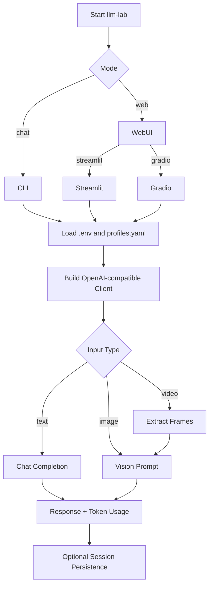

# LLM Lab

A single-entry OpenAI-compatible LLM testing tool with multimodal chat in CLI and WebUI.

[中文版](README.md)

## 1. Key Features

- One command entrypoint: `llm-lab`
- Multiple interaction modes:
  - CLI (Rich-powered terminal UI)
  - WebUI (Streamlit / Gradio)
- Multi-profile model routing
- Multimodal input support:
  - Images: direct upload
  - Videos: frame extraction to image prompts
- Session persistence for replay and debugging

## 2. Runtime Flow



## 3. Project Structure

```text
.
├── app/                  # Entrypoints and UI runners
├── service/              # Core services (chat/capability/session)
├── utils/                # Config, client, media, logger
├── config/               # Profile configurations
├── storage/              # Session and logs output
├── tests/                # Test suite
├── setup.sh              # One-shot setup script
├── pyproject.toml        # Source of dependencies
└── requirements.txt      # Exported dependency list
```

## 4. Quick Start

### 4.1 One-shot Setup (Recommended)

```bash
bash setup.sh
```

### 4.2 Manual Setup

```bash
pip install -r requirements.txt
pip install -e .
cp .env.example .env
cp config/profiles.example.yaml config/profiles.yaml
```

> [!NOTE]
> The environment variable referenced by `api_key_env` in `config/profiles.yaml`
> must exist in `.env` and contain a valid API key.
>
> [!TIP]
> For first-run validation, start with CLI streaming mode:
> `llm-lab chat --stream`
>
> [!TIP]
> If you prefer Conda execution:
> `conda run -n llm_test llm-lab chat`

## 5. Configuration

### 5.1 Important `.env` fields

- `LLM_LAB_PROFILE`
- `LLM_LAB_MODEL`
- `LLM_LAB_PROFILES_PATH`

### 5.2 Example `config/profiles.yaml`

```yaml
default_profile: dashscope_qwen

profiles:
  dashscope_qwen:
    base_url: https://dashscope.aliyuncs.com/compatible-mode/v1
    api_key_env: LLM_API_KEY
    default_model: qwen-max
    timeout_seconds: 60
    capabilities:
      supports_text: true
```

### 5.3 Configuration Priority

1. CLI arguments
2. `.env`
3. Defaults in `config/profiles.yaml`

## 6. Launch Examples

### 6.1 CLI

```bash
llm-lab chat
llm-lab chat --stream
llm-lab chat --profile dashscope_qwen --model qwen-max
llm-lab chat --save-session
```

### 6.2 WebUI

```bash
llm-lab web --ui streamlit --host 127.0.0.1 --port 8501
llm-lab web --ui gradio --host 127.0.0.1 --port 7860
```

## 7. CLI Command Reference

| Command | Description |
|---|---|
| `/help` | Show command help |
| `/status` | Show current runtime status |
| `/profiles` | List available profiles |
| `/use <profile_id>` | Switch profile |
| `/model <model_name>` | Switch model |
| `/stream on\|off` | Toggle streaming |
| `/temp <float>` | Set temperature |
| `/top_p <float>` | Set top-p |
| `/image <path1,path2,...>` | Attach images for next turn |
| `/video <path>` | Attach video for next turn |
| `/clear` | Clear current session |
| `/save [file_name]` | Save session |
| `/load <file_path>` | Load session |
| `/exit` | Exit |
| `/quit` | Exit (alias of `/exit`) |

## 8. Dependency Sync

This project uses dual dependency control:

- Source of truth: `pyproject.toml`
- Export target: `requirements.txt`

Sync command:

```bash
python scripts/sync_requirements.py
```

## 9. FAQ

| Issue | Solution |
|---|---|
| `llm-lab: command not found` | Run `pip install -e .` |
| `Missing API key` | Ensure `.env` includes the env var referenced by `api_key_env` |
| Video processing fails | Ensure `opencv-python-headless` is installed |

## 10. License

This project is licensed under the `MIT License`. See `LICENSE` for details.
